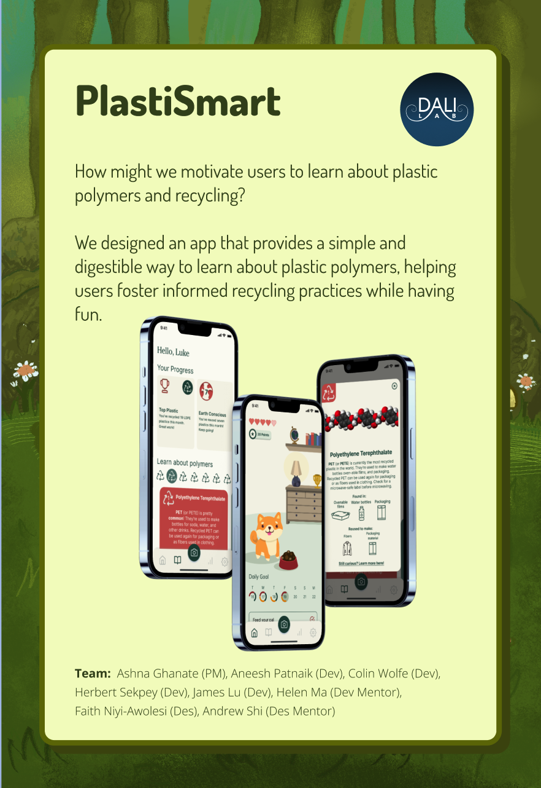

# PlastiSmart Frontend

This repository is an optional frontend starter for new DALI React projects. Installation and setup instructions are included below. You should eventually customize this README file with project-specific documentation.

## Designs


[Link to the project Figma](https://www.figma.com/design/5doTne1z3zCYPKUAZiwsuO/Plastic-Sorting-24W?node-id=5551-3487&t=ENX9gyrGE6VoCzDY-0)


## Architecture
### Tech Stack
- [Expo Go](https://expo.dev/client)
- [React Native](https://reactnative.dev/)
- [Redux Toolkit](https://redux-toolkit.js.org/)
- [axios](https://github.com/axios/axios)
- [TypeScript](https://www.typescriptlang.org/docs/)


#### External Packages
- [SendGrid](https://sendgrid.com/)
- [React Navigation](https://reactnavigation.org/)
- [React Native Reanimated](https://docs.swmansion.com/react-native-reanimated/)
- [React Native SVG](https://github.com/react-native-svg/react-native-svg)
- [Expo Camera](https://docs.expo.dev/versions/latest/sdk/camera/)
- [Expo Notifications](https://docs.expo.dev/versions/latest/sdk/notifications/)


### Style

We are using [typically a configuration like [CS52's React-Native ESLint Configuration](https://gist.github.com/timofei7/c8df5cc69f44127afb48f5d1dffb6c84) or [CS52's ES6 and Node ESLint Configuration](https://gist.github.com/timofei7/21ac43d41e506429495c7368f0b40cc7)]

### File Structure
    .
    ├── ...    
    ├── public
    ├── src                
    │   └── assets             # static assets   
    │   └── components         # reusable components across several screens
    │   └── hooks              # useAppDispatch, useAppSelector
    │   └── navigation         # defines navigation flow
    │   └── redux              # Redux store and setup
    │   └── screens            # individual pages
    │   └── types              # TS types
    │   └── utils              # utility folder containing helper files
    ├── tsconfig.json          # TypeScript configuration
    ├── package.json           # yarn config
    └── ...

For more detailed documentation on our file structure and specific functions in the code, feel free to check the project files themselves.

## Setup Steps (example)

1. clone repo and `yarn install`
   - We are using yarn because npm has issues with installing peer dependencies, which in turn causes issues when you eventually want to deploy to TestFlight
2. Add an `.env` file in the root folder and add in following properties:
   ```
   EXPO_PUBLIC_REPLICATE_API_TOKEN=...
   EXPO_PUBLIC_REPLICATE_VERSION="..."
   EXPO_PUBLIC_SERVER_URL=...
   ```
3. Fill in replicate version and URL accordingly, and change `SERVER_URL` endpoint to exact IPv4 address + port used by backend
   - You can view your IPv4 address by running `ipconfig` in command terminal
4. App should be ready for use now
   - `yarn start` to run with hot reloading
      - If you are getting "This is taking much longer than it should..." error, try doing `expo start --tunnel` instead. This error happens sometimes when trying to run on Dartmouth eduroam.

## Deployment 🚀
1. the backend is deployed through replicate.com
2. frontend is built with Expo and deployed on TestFlight
3. To build, run `eas login`, `eas build` and then `eas submit` in the terminal
   1. follow any prompts the terminal may have, like log in to Expo account, and Apple Developer account

## Authors
* Aneesh Patnaik '25, Developer
* Herbert Sekpey, Developer
* Yuchuan Ma '23+1, Developer Mentor
* Colin Wolfe '27, Data Developer
* James Lu, '25, Data Developer

## Acknowledgments 🤝
We would like to thank Ashna Ghanate for being a great PM! As well as our partners, Professor Xin Qi, and Professor Wenlin Zhang, for being supportive and formative throughout this journey.

---
Designed and developed by [@DALI Lab](https://github.com/dali-lab)
