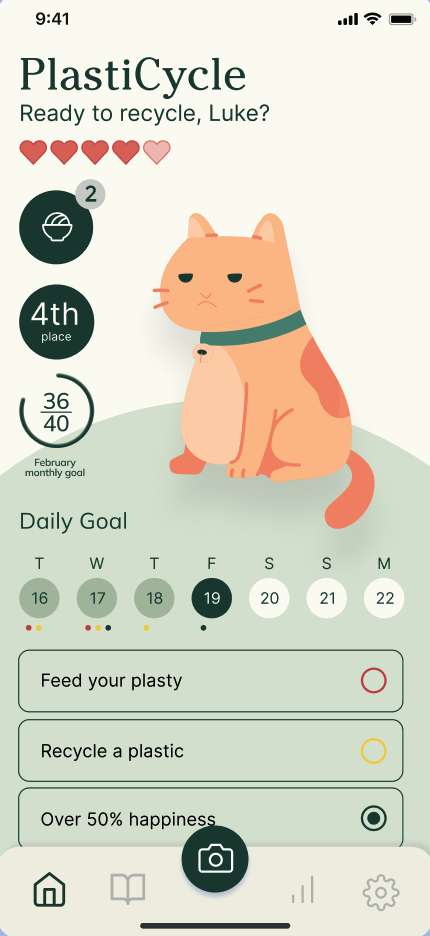
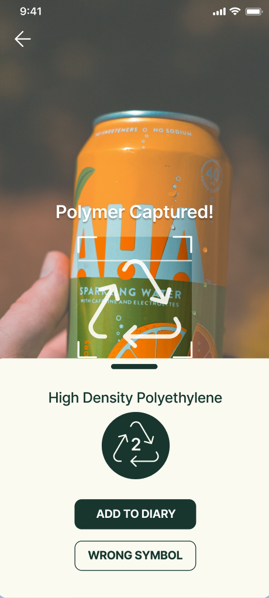
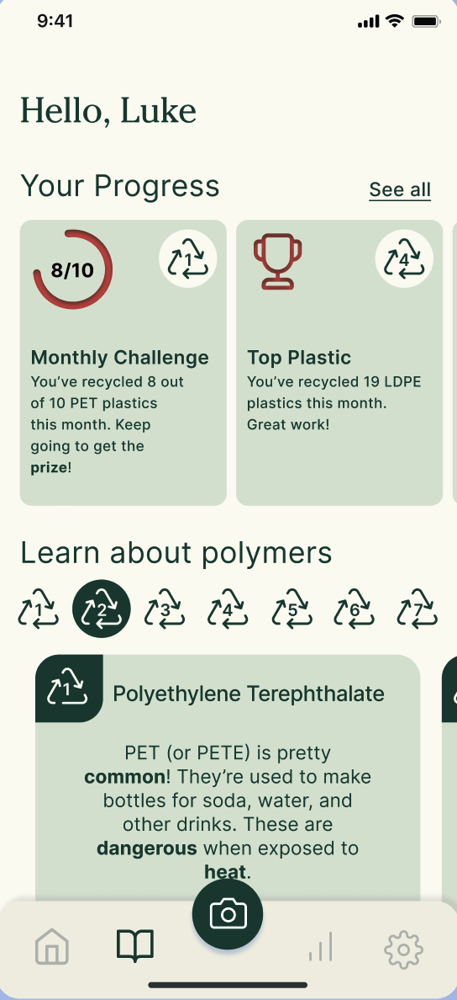

# Plastic Sorting App Front End

Despite the widespread presence of symbols on plastic products and the abundance of information about recycling, there hasn't been a compelling method for educating younger generations on the various types of plastics, their recycling procedures, and their impact on the environment.

Our plastic sorting app simplifies and enlivens the learning process. It features a scanning tool that identifies the plastic symbol on a product, enabling users to ascertain the type of plastic they are using. Additionally, the app incorporates incentives: users earn snacks for their avatars as they scan more products and achieve monthly objectives. It also introduces a competitive element by including leaderboards among friends.

## Designs

[Link to the project Figma](https://www.figma.com/file/5doTne1z3zCYPKUAZiwsuO/Plastic-Sorting-24W?type=design&node-id=1%3A154&mode=design&t=haH1j12vXJcLT8cN-1)

## Architecture
### Tech Stack
- [Expo Go](https://expo.dev/client)
- [React Native](https://reactnative.dev/)
- [Redux Toolkit](https://redux-toolkit.js.org/)
- [axios](https://github.com/axios/axios)
- [TypeScript](https://www.typescriptlang.org/docs/)

#### External Packages
- [Expo Camera]
- [ionicons]

### Style
We are using [CS52's React-Native ESLint airbnb base Configuration](https://gist.github.com/timofei7/c8df5cc69f44127afb48f5d1dffb6c84) or [CS52's ES6 and Node ESLint Configuration](https://gist.github.com/timofei7/21ac43d41e506429495c7368f0b40cc7)

### File Structure
    .
    ├── ...    
    ├── images                 # for this readme
    ├── src                
    │   └── assets             # static assets   
    │   └── components         # reusable components across several screens
    │   └── hooks              # useAppDispatch, useAppSelector
    │   └── navigation         # defines navigation flow
    │   └── redux              # Redux store and setup
    │   └── screens            # individual pages
    │   └── types              # TS types
    │   └── utils              # utility folder containing helper files
    ├── tsconfig.json          # TypeScript configuration
    ├── package.json           # yarn config
    ├── app.json               # expo config
    ├── yarn.loc               # faster yarn dependency downloading and linking
    └── babel.config.js        # babel linting config

For more detailed documentation on our file structure and specific functions in the code, feel free to check the project files themselves.

## Setup Steps (example)

1. clone repo and `yarn install`
   - We are using yarn because npm has issues with installing peer dependencies, which in turn causes issues when you eventually want to deploy to TestFlight
2. Change `SERVER_URL` endpoint to exact IPv4 address + port used by backend
   - You can view your IPv4 address by running `ipconfig` in command terminal
3. App should be ready for use now
   - `yarn start` or `expo start` to run with hot reloading
      - If you are getting "This is taking much longer than it should..." error, try doing `expo start --tunnel` instead. This error happens sometimes when trying to run on Dartmouth eduroam.

## Deployment 🚀
Going to be on testflight next term

## Authors
* Aneesh Patnaik '25, Dev
* Jack Macy '25, Dev
* Yuchuan (Helen) Ma '23, Dev

## Acknowledgments 🤝
We would like to thank Ashna Ghanate for being the best PM, the design team for their work and Eric for not being annoyed by us asking for help all the time.

---
Designed and developed by [@DALI Lab](https://github.com/dali-lab)
